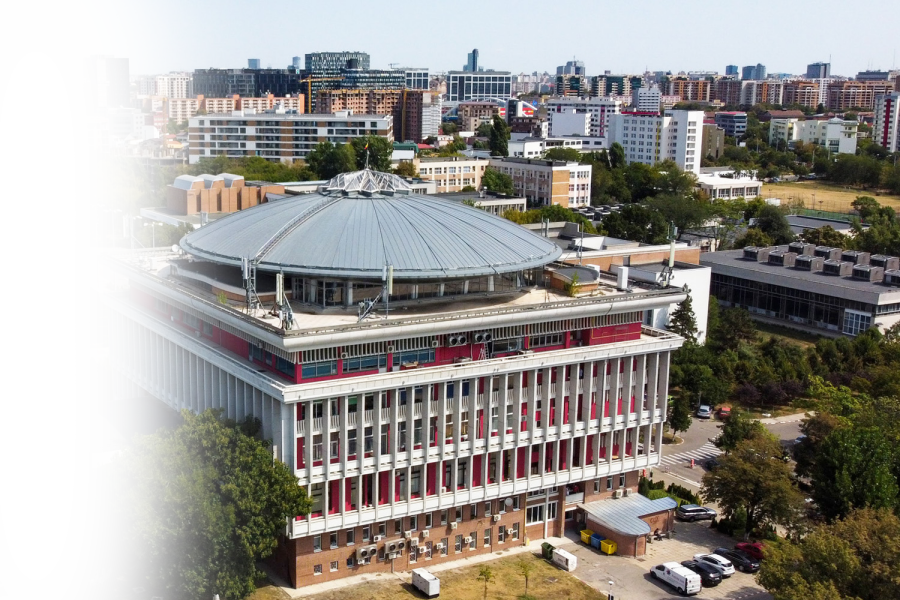

<h1 align="center">Matei Goidan</h1>

###

  &nbsp;
  &nbsp;

---

  Hello · Salut · Ciao · Hallo to my github page! I am a final-year <b> Computer Science Student </b> at the <b> University of Bucharest</b>. In the year <b>2023/2024</b> I attended an exchange year at <B>Sapienza</B> in <b>Rome</b>. Currently interested in <b>Computer Vision</b> and <b>Machine Learning</b>.

---

  

