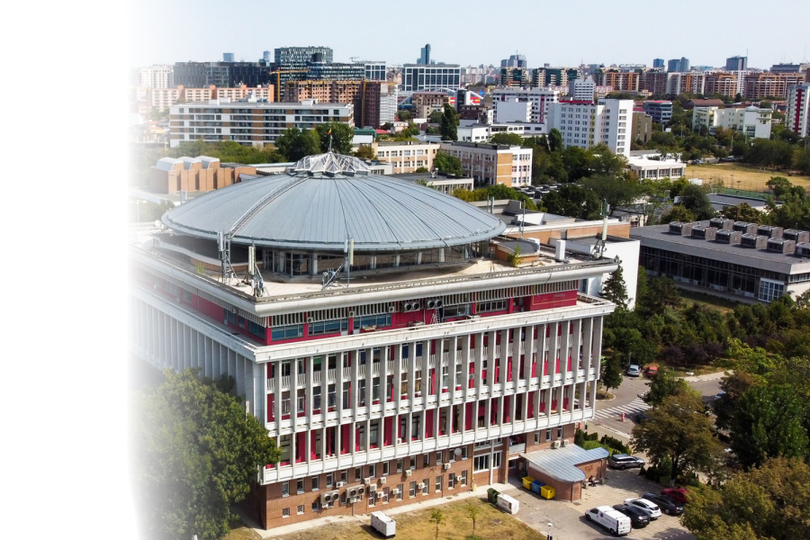

<h1 align="center">Matei Goidan</h1>

###

  &nbsp;
  &nbsp;
  &nbsp;

---

Hello · Salut · Ciao · Hallo to my GitHub page! I'm a <b>first-year Master's student in Artificial Intelligence</b> at <b>Politehnica University of Bucharest</b>. I completed my <b>Bachelor's degree in 2025</b> at the <b>University of Bucharest</b>, and during 2023-2024 academic year I attended an exchange semester at <b>Sapienza University of Rome</b>. I'm currently interested in <b>Computer Vision</b> and <b>Machine Learning</b>.

---

  

---

    
    

